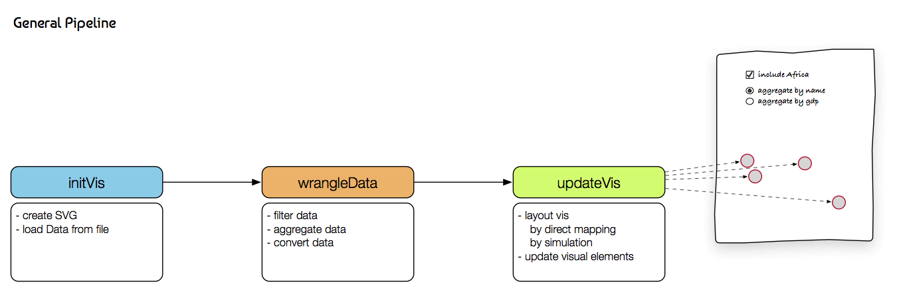
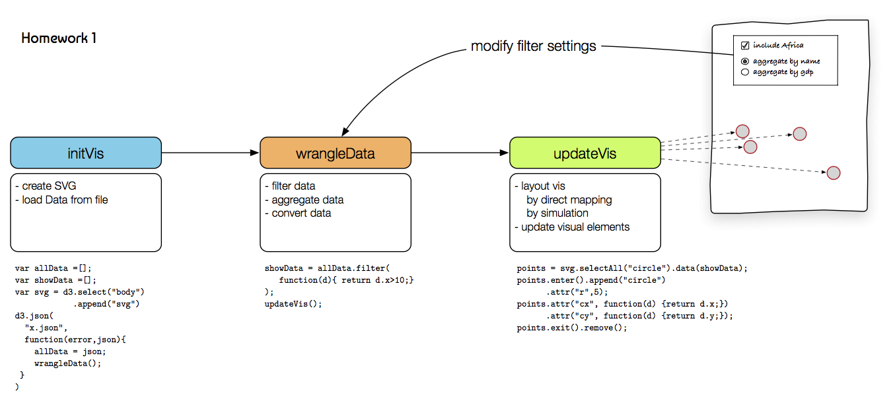
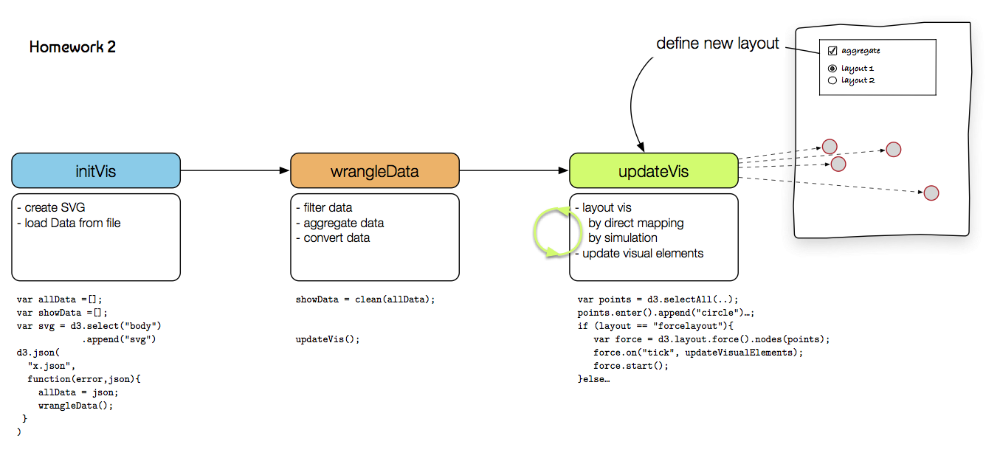

D3 Tutorial
===========

This is a short tutorial introducing the basic elements and concepts of D3. D3 stands for Data-Driven Documents and is a very popular JavaScript library written by [Mike Bostock](http://bost.ocks.org/mike/).

Homepage: http://d3js.org/

Github: https://github.com/d3/d3

API Documentation: https://github.com/d3/d3/blob/master/API.md

Gallery: https://github.com/mbostock/d3/wiki/Gallery

Examples: **everywhere** just google it

License: BSD-3-Clause license

Download / Include:

-	`<script src="http://d3js.org/d3.v4.js" charset="utf-8"></script>`
-	https://github.com/d3/d3/releases/latest

Elements
--------

> SURVEY: What do you guys already know?

-	JS - JavaScript / JSON (JavaScript Object Notation)
-	CSS - Cascading Style Sheets
-	SVG - Scalable Vector Graphics

JS - JavaScript
===============

```js
//variables
let x = 5;
let s = "abc";
let s2 = 'abc';
let arr = [1,2,4];
let obj = { a : 10, b : 'test'};
//access: obj.a or obj['a']

//conditionals
if (x < 10) {
  console.log('small');
} else {
  console.log('large');
}

let x2 = x < 10 ? 20 : 30;

//loops
for(let i = 0; i < arr.length; i++) {
  x += arr[i];
}
// for of
for(let ai of arr) {
  x += ai;
}

let i = 0;
while(i < 10) {
  x += i++ * 10;
}

//functions
function add(a,b) {
  return a + b;
}
let sub = (a,b) => {
  return a - b;
}
console.log(add(10,30), sub(10,5));

//functional style programming
arr.forEach((d) => x += d);
let arr2 = arr.map((d)  => d* 10);
let arrf = arr.filter((d) => d < 3);
//function are first-level objects
function compute(f, a, b) {
  return f(a,b);
};
console.log(compute(add, 20,10));

```

CSS - Cascading Style Sheets
============================

Great way to spearate the style from the actual content. In addition, the selector notation is used for navigation and selections in D3.

Good overview of CSS Selectors: http://code.tutsplus.com/tutorials/the-30-css-selectors-you-must-memorize--net-16048

Most important selectors:

```html
<html>
<body>
  <div class="header">
    D3 Test
  </div>
  <div id="main">
    <p class="header">Lorem Impsum Header</p>
    <p>Lorem Impsum</p>
  </div>
</body>
</html>
```

| Selector     | Meaning                                  |
|--------------|------------------------------------------|
| `div`        | select all `div` elements                |
| `.header`    | select elements having class `header`    |
| `#main`      | select the element with the id `main`    |
| `div.header` | select all `div` with class `header`     |
| `div p`      | select all descendent `p` within a `div` |
| `div:hover`  | matches when the mouse hovers a `div`    |

SVG - Scalable Vector Graphics
==============================


https://en.wikipedia.org/wiki/Scalable_Vector_Graphics

SVG describes the image to be drawn instead of drawing it.

Example:

```html
<svg>
  <circle r="10" cx="20" cy="20" fill="green" />
  <rect x="18" y="18" width="30" height="20" style="fill: blue" />
  <text x="10" y="30">Test</text>
</svg>
```

Draws a circle at `20,20` (origin is the top left corner) with a radius of `10` filled with a `green` color. **Hint:** the order defines the visibility order --> the last one is on top

Some examples: [Primitive Examples](i/primitives.svg)

Important elements:

-	`circle(cx, cy, r)`
-	`rect(x, y, width, height)`
-	`line(x1, y1, x2, y2)`
-	`text` ... text as the body of the element
-	`path(d)` ... complex shapes
-	`g` ... grouping of elements
-	**Hint:** `title` ... can be a child of each element for creating a decription shown as a tooltip

Important attributes:

-	`style` ... set CSS style attribute
-	`fill` ... fill color
-	`stroke` ... stroke color
-	`transform` ... apply a linear transformation on the element and its children (in case of a `g` element), e.g., `transform="translate(100,10)rotate(90)scale(2,2)"`

3 ways for specifying the fill color of an element:

1.	inline style: `style="fill: green"`
2.	fill attribute: `fill="blue"`
3.	css rule: `circle { fill: blue; }`

Development Environment
=======================

Using a good development environment can save you time and prevent you from pain. Editors like [Sublime](http://www.sublimetext.com/) or [Atom](https://atom.io) are a good start. Fully fledged integrated development environments such as [WebStorm](https://www.jetbrains.com/webstorm/) or [Eclipse](http://www.eclipse.org/webtools/) may be complex at a first glance but provide a bunch of useful features.

Chrome Developer Tools
----------------------

The [Chrome Developer Tools](https://developer.chrome.com/devtools) are a great set of utilities for web development.

Among other you have:

-	Web Inspector
	-	Properties
	-	CSS Style Selector
-	Console
	-	in-place coding
	-	`console.log`, `console.error`
-	Debugger
	-	(Conditional) Breakpoints
	-	Callstack
	-	Console context
	-	`debugger` statement a hard-coded breakpoint forcing the debugger to stop (if the developer tools are opened)
-	Profiler profile your JS code for bottlenecks
-	Network look at all the requests/responses of your website

Every major web browser (Firefox, Safari, Internet Explorer, etc.) has integrated developer tools.

###Local WebServer

While you can view local sites (`file:///`), Chrome doesn't allow you to load additional external files, e.g., JSON files, for security reasons. Therefore, you need a local webserver running for development. As alternative you can use an integrated IDE (such as [WebStorm](https://www.jetbrains.com/webstorm/)\) that has a webserver already integrated.

Starting a simple python static webserver:

```bash
python -m SimpleHTTPServer
```

Full list: https://gist.github.com/willurd/5720255

Dive into D3
============

A fundamental concept in D3 is binding a DOM element to a data item and manipulate the attributes according to the bound data item. For example, you have a list of persons each having two numerical attributes (age, weight) and a categorical one (gender). You bind each person to an SVG circle element and set the circle's x-position according to the age and the y-position according to the weight. If you additionally fill the circle according to the person's gender, you end up with a simple colored scatterplot visualization.

Code: [persons.html](examples/persons.html)

Simple Selections and Manipulations
-----------------------------------

All functions of D3 are available under the namespace: `d3`. The most important functions are `select` and `selectAll`. `select` requires in the simplest form an CSS selector string as argument and returns an selector object for the first matching element only. `selectAll` returns a list of matched elements respectively. **Hint:** both functions won't throw an error if no element was found, in either cases they return a dummy selector, having no effect.


```js
let header = d3.select('div.header');
```

Selectors provides a couple of function for manipulating the DOM element including: `attr`, `style`, `classed`, `text`, and `html`.

```js
let circle = d3.select('circle');
circle.attr('r', 10);
circle.attr('cx', 20);
circle.attr('cy', 23);

//alternative syntax via chaining
circle.attr('r', 10)
      .attr('cx', 20)
      .attr('cy', 23);

//set css styles
circle.style('stroke-width', 2);

//add, remove css classes
circle.classed('highlight', true);

//set inner text
d3.select('text').text('Hello');
d3.select('div').html(`<strong>Hello</strong>`);

```

The function come in different shapes: as setter (previous examples) as in a getter version. In the later case the value of the first element in the list will be returned. e.g. `circle.attr('cx')`

### DOM Manipulation

the dom elements can be manipulated using. `append` and `remove`

```js
let body = d3.select('body');
body.append('svg').attr('width', 800).attr('height',600);

d3.select('svg').remove();
```

Data Join: Enter / Update / Exit
--------------------------------

The basic idea of D3 is binding data items to DOM elements and manipulate them accordingly. We can distinguish three different cases when binding a bunch of data items to a set of DOM elements:


for each of the cases we have to tell D3 what to do. e.g. when we have more data items than DOM elements, we are in the *enter* phase and need to specify a way how to create the remaining ones. Similarly if we more DOM elements than data items we are in the *exit* phase and need to take care of removing the superfluous ones.

basic workflow:

HTML boilerplate
```html
<svg width="300" height="300">
</svg>
```


```js
const data = [1,2,3];
//select svg element
//select all circles - even if there none yet - and bind the data array *data* onto them
let circles = d3.select('svg').selectAll('circle').data(data);

//enter phase
//append an element matching the selector and set constant attributes
let circles_enter = circles.enter().append('circle');
circles_enter.attr('r', 10);

//update phase ... actually update all including the newly created ones
let circles_update = circles;
let circles_update_and_enter = circles_update.merge(circles_enter);

//function argument given two parameters:
//1. argument (common name: d): the current data item
//2. argument (common name: i): the index of the data item in the data array
//this context: the current DOM element
circles_update_and_enter.attr('cx', (d,i) => d*10);
circles_update_and_enter.attr('cy', (d,i) => i*50);

//exit phase
let circles_exit = circles.exit();
circles_exit.remove();
```

common shortcut

```js
const data = [1,2,3];
let circles = d3.select('svg').selectAll('circle').data(data);

let circles_enter = circles.enter().append('circle')
  .attr('r', 10);

circles.merge(circles_enter)
  .attr('cx', (d,i) => d*10)
  .attr('cy', (d,i) => i*50);

circles.exit().remove();
```

**Hint**: common pitfall

```js
let data = [1,2,3];
let circles = d3.select('svg').selectAll('circle').data(data)
  .enter().append('circle')
  .attr('r', 10);

//what is the difference to the previous one?
circles
  .attr('cx', (d,i) => d*10)
  .attr('cy', (d,i) => i*50);

//exit is not defined?
circles.exit().remove();
```

This is a common pitfall when using d3 resulting from premature optimization. In this case it `circles` stores the *enter*-phase instead of the generic data-join selection. This happens quite often you just create a visualizations but don't think about updating your visualization. The first error is that the `exit` function is not defined. The severe problem is that the next time you run the same function even with modified dataset, the attributes `cx` and `cy` won't be updated. The reason is that the *enter*-phase selector is empty, since there is no need for new DOM elements.

---

INTERACTIVE: creating a bar chart: [barchart01_initial.html](examples/barchart01_initial.html) [Open in Codepen](http://codepen.io/sgratzl/pen/xRrrgp)

---

### Nested Selections and Nested Data Joins

Nested selections can be used for adding inner elements. A common approach is creating one `g` element for each data item and add several sub DOM elements. The sub element will be created during the enter-phase and updated using `select`. By using `select` function the data-join remains using `selectAll` a nested data join will be created. Nested data joins are useful for hierarchical data.

nested data join

```js
//hierarchical data
const data = [{ name: 'a', arr: [1,2,3]}, { name: 'b', arr: [3,2,4] }];

let groups = d3.select('svg').selectAll('g').data(data);

let groups_enter = groups.enter().append('g')

let groups_update = groups.merge(groups_enter)
  .attr('transform', (d, i) => `translate(${i * 20 + 10},10)`);

//select all circles within each group and bind the inner array per data item
let circles = groups_update.selectAll('circle').data((d) => d.arr);

//normal data-join
let cirles_update = circles.enter().append('circle');

circles.merge(cirles_update)
  .attr('r', (d) => d*2)
  .attr('cy',(d,i) => i*20);

circles.exit().remove();

groups.exit().remove();
```

nested selection

```js
const data = [1,2,3];
let circles = d3.select('svg').selectAll('circle').data(data);

let circles_enter = circles.enter().append('circle')
  .attr('r', 10);
circles_enter.append('title');

let circles_update = circles.merge(circles_enter)
  .attr('cx', (d,i) => d*10)
  .attr('cy', (d,i) => i*50);

circles_update.select('title').text((d) => d);

circles.exit().remove();
```

---

INTERACTIVE: adding a title attribute: [barchart02_title.html](examples/barchart02_title.html) [Open in Codepen](http://codepen.io/sgratzl/pen/PbjjWv)

---

Data Loading: d3.json, d3.csv
-----------------------------

In the current version we have static hard-coded data in our files. D3 provides a bunch of function for loading external files. The most important ones are `d3.json` for loading JSON files and `d3.csv` for CSV files respectively. **Important** Data Loading is **asynchronous**. That means you won't get the data immediately as a return value. But you are handing in a callback function, as soon as the data are ready. You can't predict when this happens. You have to structure your code accordingly.

```js
d3.json('file_to_load.json', (error, data) => {
  if (error) {
    console.error('cant load data');
  } else {
    //do something with the data
  }
});
```

**Hint**: D3 is smart enough, when just one argument is given that it will interpreted as the data argument

```js
d3.csv('file_to_load.csv', (error, data) => {
  if (error) {
    console.error('cant load data');
  } else {
    //array of objects
    console.log(data.length);
    //do something with the data
  }
});

```

see also: https://github.com/d3/d3-request/blob/master/README.md#csv for formatting and parsing options

**Warning**: Chrome doesn't allow that local files access other local files using XmlRequests by default. (Firefox does). So, you need a local webserver running on your machine

---

INTERACTIVE: loading [weather.json](examples/weather.json): [barchart03_json.html](examples/barchart03_json.html) [Open in Codepen](http://codepen.io/sgratzl/pen/JbJJWL)


Scales and Axes
---------------

As seen in the barchart example, mapping a value to a pixel value manually is a pain. D3 provides scales for this case. The idea is creating a mapping function between the domain values (data space) and the output range (pixel space).

[](http://www.jeromecukier.net/blog/2011/08/11/d3-scales-and-color/)

D3 provides different scales:

-	quantitative
	-	`d3.scaleLinear()` ... linear mapping between domain and range
	-	`d3.scalePow()`
	-	`d3.scaleLog()`
-	ordinal
	-	`d3.scaleOrdinal()`
  - `d3.scaleBand()`
  - `d3.scalePoint()`
-	predefined [categorical color scales](https://github.com/d3/d3-scale#schemeCategory10):
	-	`d3.scaleOrdinal(d3.schemeCategory10)`
	-	`d3.scaleOrdinal(d3.schemeCategory20)` ... special property: dark/bright pairs
	-	`d3.scaleOrdinal(d3.schemeCategory20b)` ... 4 brightness levels per color
	-	`d3.scaleOrdinal(d3.schemeCategory20c)` ... 4 brightness levels per color

```js
const scale = d3.scaleLinear().domain([0,5]).range([0,200]);
const cscale = d3.scaleLinear().domain([0,5]).range(['black','white']);

...
//the scale can be applied as a function
circles_update
  .attr('cx', (d) => scale(d))
  .style('fill', (d) => cscale(d));
```

```js
//domain is a list of strings or numbers
const scale = d3.scaleOrdinal().domain(['a','b','c']).range([10,20,30]);
//distribute as a band for each item
const bscale = d3.scaleBand().domain(['a','b','c']).range([0,200]);

...
//the scale can be applied as a function
circles.attr('cx', (d) => scale(d));
```

In addition, it is quite common adding a axis for your charts. D3 provides a utility function for this case : `d3.svg.axis()`. It uses a scale as input and the necessary SVG elements for you.

```js

const scale = d3.scaleLinear().domain([0,5]).range([0,200]);

const axis = d3.axisBottom().scale(scale);

//create a container to put the axis  
const axis_container = d3.select('svg').append('g')
  .attr('class', 'axis')
  .attr('transform', 'translate(0,200)');

//call axis to create the SVG elements for you
axis_container.call(axis);

```

---

INTERACTIVE: adding linear and ordinal scale: [barchart04_scale.html](examples/barchart04_scale.html) [Open in Codepen](http://codepen.io/sgratzl/pen/aBwwWE)

---

Interactivity
-------------

Interactivity is event-driven as in the usual DOM. However, you have easy access to the currently bound data-item. The raw DOM event is hidden but can be accessed using `d3.event`. This is useful for stopping the event propagation (bubbling) `d3.event.stopPropgation()` or preventing the default behavior `d3.event.preventDefault()`. Moreover, the current context of the function `this` is the current DOM element.

```js
const data = [1,2,3];
let circles = d3.select('svg').selectAll('circle').data(data);

circles.enter().append('circle')
  .attr('r', 10)
  .attr('cy', 40)
  .attr('cx', (d,i) => 30+i*30)
  .on('click', function(d, i) {
    console.log(`clicked on: ${d} (${i})`);
    const circle = d3.select(this); //can't use arrow scoping
    circle.style('stroke', 'orange');
  });
```

commonly used events: `click`, `mouseover/mouseout`, `mouseenter/mouseleave`, `change`, `input`

---

INTERACTIVE: filter US cities: [barchart05_interactive.html](examples/barchart05_interactive.html) [Open in Codepen](http://codepen.io/sgratzl/pen/BQZZZB)

---

Transitions
-----------

Animated transitions can help the user understanding changes and are just fun to watch. Transitions in D3 are very simple. Just add `.transition()` within a selector and the changes afterwards are done in an animated fashion. D3 is very smart when it comes to interpolating values, colors, and much more. Transitions can be used during all phases: enter, update, and exit. By nesting transitions you can create fancy animations with just a bunch line of code.

```js
const data = [1,2,3];
let circles = d3.select('svg').selectAll('circle').data(data);

let circles_enter = circles.enter().append('circle')
  .attr('r', 10)
  .attr('cx', 100)
  .attr('cy', 100); //useful default values for animation

circles.merge(circles_enter)
  .transition()
  .duration(1000) //duration of the animation
  .delay(200) //delay animation start
  .attr('cx', (d,i) => d*50)
  .attr('cy', (d,i) => 40+i*100)
    .transition() //start another transition after the first one ended
    .attr('r', 20);

circles.exit().remove();
```

D3 is rather dumb when it comes to mapping data items to DOM elements. It doesn't take the order into account. So, if element 'a' was previously at the first position and now on the third it will bind it to the third element. However, this hampers animations, i.e. animated sorting. By using the *key* argument of the `data` function, one can force that the same DOM element is bound to the same data item regardless of the item order.

```js
const cscale = d3.scaleOrdinal(d3.schemeCategory10).domain(['a','b','c', 'd']);
const xscale = d3.scaleBand().domain(['a','b','c', 'd']).range([10,200]);

function update(data) {
  let s = d3.select('svg');
  //key argument return a unique key/id per data-item (string)
  let circles = s.selectAll('circle').data(data, (d) => d);

  //a will be bound to the first DOM element
  let circles_enter = circles.enter().append('circle')
    .attr('r', 10)
    .attr('cx', xscale)
    .style('fill', cscale);

  circles.merge(circles_enter)
    .transition()
    .attr('cy', (d,i) => 10+i*20)

  circles.exit().remove();
}

let data = ['a','b','c'];
update(data);

//later on... 2secs
setTimeout(() => {
  data = ['c','a','d'];
  //the items will move to their new position,
  //and the DOM element for 'b' will be removed
  //and another one for 'd' created
  update(data);
}, 2000)

```

---

INTERACTIVE: animated filter: [barchart06_interactive.html](examples/barchart06_interactive.html) [Open in Codepen](http://codepen.io/sgratzl/pen/zozzzE)

---

---

INTERACTIVE: final results [barchart07_final.html](examples/barchart07_final.html) [Open in Codepen](http://codepen.io/sgratzl/pen/gLRRRJ)

---

Layouts
=======

D3 provides a bunch of standard layouts. A layout does not actually render the visualization but prepares your data, such that you can render, e.g. a pie chart. Most of the time the work with helper tools for SVG from D3. e.g. the `d3.layout.pie()` works best with `d3.svg.arc()`.

A full list of all available layouts can be found at: https://github.com/mbostock/d3/wiki/Layouts

Basic Setup
-----------



example including a feedback loop:



example including a layout simulation:



Pie Layout
----------

A pie-layout is a simple layout algorithm. It takes the data and a way to sort/compute the value per slice. It wraps the data and enhance it with additional attributes for the pie slice, such as start end end angle. *Hint* the angles and arcs are computed relatively to the pie's center. The computed attributes with another utility function `d3.svg.arc()` which converts the given values to a SVG path.

---

SEE: [pie.html](examples/pie.html)

---

Force Layout
------------

A force layout is a graph layout algorithm, which uses a simulation for positioning nodes. The goal is to minimize the force applied on the system introduced by gravity, node repulsive force, and edge attraction forces. In this case it is not a one layout step, but a continuous one, where on each `tick` a new set of positions are available.

---

SEE: [miserables.html](examples/miserables.html)

---

What Else
=========

-	Geo Projection: GeoJSON, TopoJSON, Projection: https://github.com/mbostock/d3/wiki/Geo-Projections
-	Time: Scales, Formatting/Parsing, ...
-	Behaviors:
	-	Zoom
	-	Drag
-	Array Utilities: `d3.sum`, `d3.max`, `d3.set`, `d3.map`
-	Selector Utilities: `.sort()`, `.filter()`, `.raise()`, `.lower()`

Boilerplate
===========

Basic Setup
-----------

online: http://codepen.io/sgratzl/pen/mOwrxO/

Github repository: https://github.com/sgratzl/d3boilerplate

Linking of two plots example
----------------------------

online: http://codepen.io/sgratzl/pen/zopEgX

Github repository: https://github.com/sgratzl/d3boilerplate_linking


What Else Besides D3
====================

Tableau
-------

http://www.tableau.com/

The big player for commercial fat client data visualization.


(c) http://www.marketwatch.ro

HighCharts
----------

http://www.highcharts.com/

commercial JavaScript Plot library


(c) http://webdesignbooth.com

Processing
----------

https://processing.org/ and http://processingjs.org/ for a web-version

own programming language for visualizations with OpenGL backend


Others
------

e.g. Plot.ly (https://plot.ly/) - chart creation

Frameworks on top of D3:
------------------------

-	NVD3 (http://nvd3.org/) - reusable plots on top of D3
-	Cubism (https://square.github.io/cubism/) - Time Series Data
-	Vega (http://trifacta.github.io/vega/) - declarative description of plots
-	Crossfilter (http://square.github.io/crossfilter/) - Fast Multidimensional Filtering for Coordinated Views
-	...

Thank You
