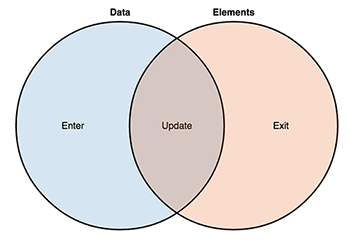
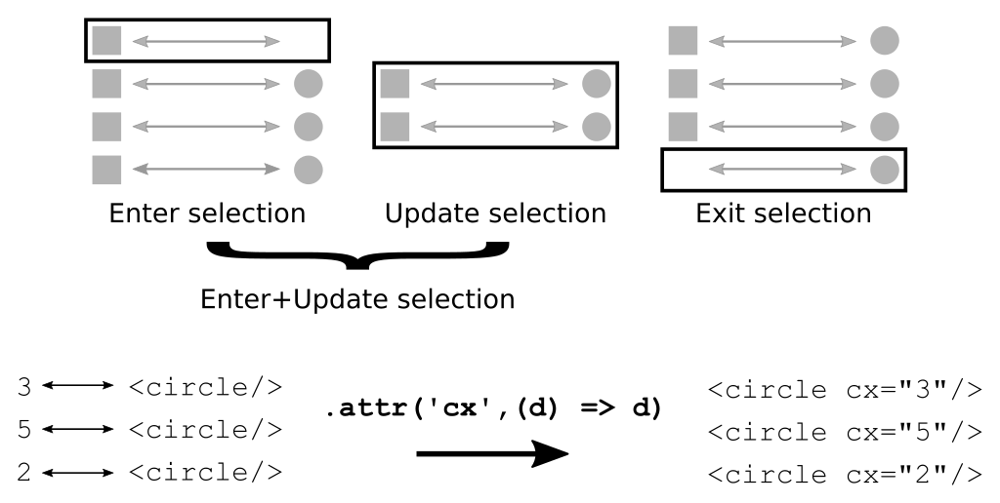
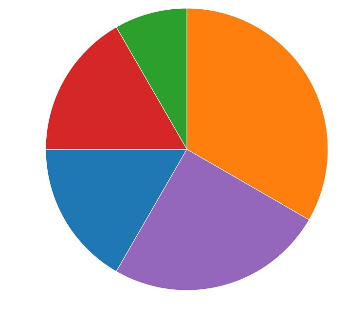
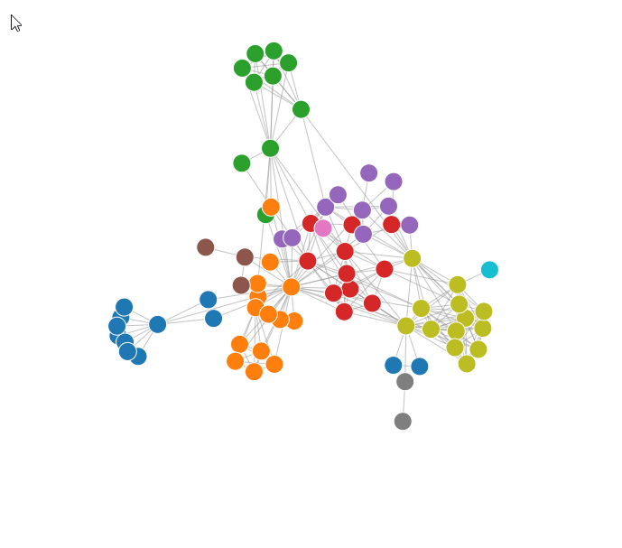
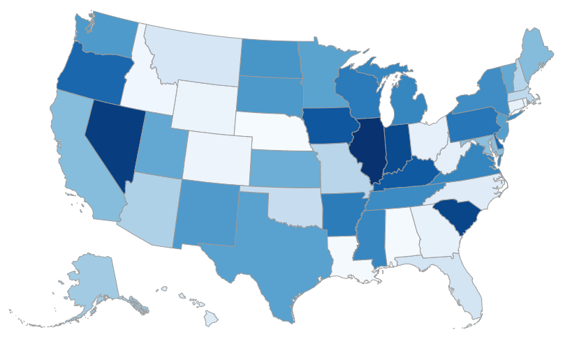
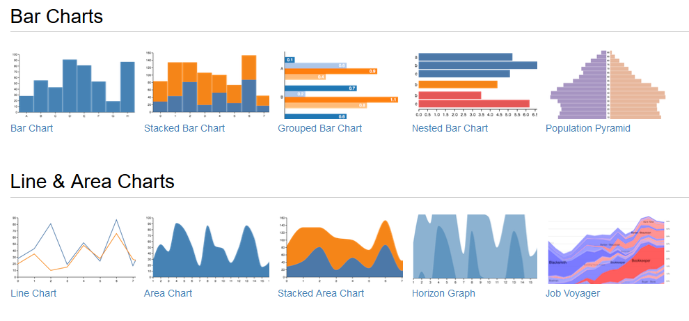
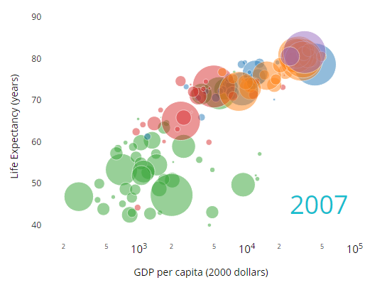
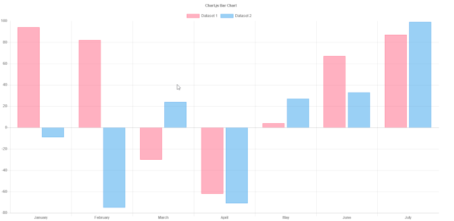
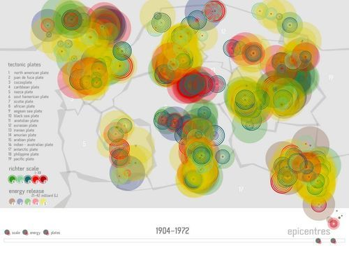
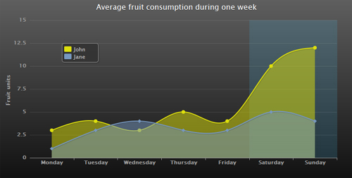

# D3 Tutorial

This is a short interactive tutorial introducing the basic elements and concepts of D3. At the beginning of this tutorial the foundations of D3 namely HTML, CSS, SVG, and JavaScript are briefly explained.

Then, the basic principles of D3 and its functions are introduced by incrementally implementing an interactive bar chart.
The example can be implemented manually or directly by editing the [CodePen](https://codepen.io) examples.

The final result looks like:


In the second part of this tutorial a more complex multiple coordinated view (MCV) setup is incrementally implemented. A multiple coordinated view setup consists of multiple visualizations that are interactively linked together such
as selecting an element in one visualization filters the data in a second one. This is also called linking and brushing. Along with this example some guidelines
regarding code structure and advanced D3 transitions are given.

The final result looks like:


This tutorial concludes with a brief introduction into other visualization libraries and hints about how to use D3 with [TypeScript](https://www.typescriptlang.org/).

Now, shall we begin...

---

D3 stands for Data-Driven Documents and is a very popular JavaScript library written by [Mike Bostock](https://bost.ocks.org/mike/).

Homepage: https://d3js.org/

Github: https://github.com/d3/d3

API Documentation: https://github.com/d3/d3/blob/master/API.md

Gallery: https://github.com/mbostock/d3/wiki/Gallery

Examples: **everywhere** just google it

License: BSD-3-Clause license

Download / Include:

- `<script src="https://d3js.org/d3.v7.js" charset="utf-8"></script>`
- https://github.com/d3/d3/releases/latest

## Credits

This tutorial is created and maintained by [Samuel Gratzl](https://github.com/sgratzl/d3tutorial), with contributions from [Holger Stitz](https://github.com/thinkh/d3tutorial), and based on a tutorial by [Alexander Lex](https://dataviscourse.net/2016/tutorials/).

---

# Content

- [Development Environment](#dev-environment)
- [HTML - Hypertext Markup Language](#html)
- [CSS - Cascading Style Sheets](#css)
- [SVG - Scalable Vector Graphics](#svg)
- [JS - JavaScript / JSON (JavaScript Object Notation)](#js)

Part 1: Student's First Barchart

- [D3 - Data-Driven Documents](#d3)
- [Simple Selections and Manipulations](#d3-selections)
- [Data Join: Enter / Update / Exit](#d3-data-join)
- [Data Loading: d3.json, d3.csv](#d3-data-loading)
- [Scales and Axes](#d3-scales-axes)
- [Interactivity](#d3-interactivity)
- [Transitions](#d3-transitions)

Part 2: Student's First Multiple Coordinated View

- [Code Structure](#code-structure)
- [D3 Layouts](#layouts)
- [Interactivity 2](#interaction2)
- [Reusability](#reuse)
- [Transitions 2](#transitions2)

Extras

- [More D3](#more-d3)
- [D3 Boilerplate](#boilerplate)
- [What Else Besides D3](#beside-d3)

Appendix

- [TypeScript and D3](#typescript)

> SURVEY: What do you guys already know?

---

<a id="dev-environment"></a>

# Development Environment

Using a good development environment can save you time and prevent you from pain. Editors like [Visual Studio Code](https://code.visualstudio.com), [Sublime](https://www.sublimetext.com/), or [Atom](https://atom.io) are a good start. Fully fledged integrated development environments such as [WebStorm](https://www.jetbrains.com/webstorm/) or [Eclipse](https://www.eclipse.org/webtools/) may be complex at a first glance but provide a bunch of useful features.

## Chrome Developer Tools

The [Chrome Developer Tools](https://developer.chrome.com/devtools) are a great set of utilities for web development.

Among other you have:

- Web Inspector
  - Properties
  - CSS Style Selector
- Console
  - in-place coding
  - `console.log`, `console.error`
- Debugger
  - (Conditional) Breakpoints
  - Callstack
  - Console context
  - `debugger` statement a hard-coded breakpoint forcing the debugger to stop (if the developer tools are opened)
- Profiler profile your JS code for bottlenecks
- Network look at all the requests/responses of your website

Every major web browser (Firefox, Safari, Edge, Internet Explorer, etc.) has integrated developer tools.

## Local WebServer

While you can view local sites (`file:///`), Chrome doesn't allow you to load additional external files, e.g., JSON files, for security reasons. Therefore, you need a local webserver running for development. As alternative you can use an integrated IDE (such as [WebStorm](https://www.jetbrains.com/webstorm/)) that has a webserver already integrated.

In case you are using Visual Studio Code we can recommend the [Live Server](https://marketplace.visualstudio.com/items?itemName=ritwickdey.LiveServer) extension.

Starting a simple python static webserver:

```bash
python -m SimpleHTTPServer
```

Full list: https://gist.github.com/willurd/5720255

## Git (Version Control)

Using a version control tool (in our case git) tracks changes to your code. Git keeps copies of multiple states of files, which allows you to go back to an older version.

We are using [Github](https://github.com), an online tool for hosting git repositories. You can sign up there and create a public git repository for free.

You should already have git installed, if not see the [official documentation](https://git-scm.com/book/en/v2/Getting-Started-Installing-Git) on how to install git on your operating system. Alternatively, you can use [GitHub Desktop](https://desktop.github.com/).

---

<a id="html"></a>

# HTML - Hypertext Markup Language

In HTML the markup is represented by elements. An HTML element is a portion of the content that is surrounded by a pair of tags of the same name. Like this:

```html
<strong>This is an HTML element.</strong>
```

HTML elements can be nested:

```html
<strong>This is an <u>HTML</u> element.</strong>
```

The opening tag of an element can contain extra information as attributes:

```html
<a href="https://www.google.com">A link to Google's main page</a>
```

The `a` element (which stood for "anchor") describes a link. The attribute `href` means "HTML reference". The meaning given to each attribute changes from element to element.

Elements contain attributes, for instance `id`, `class`, and `style`. The `id` attribute must be unique through the entire document and can be accessed easily from JavaScript. It can be seen as a global variable.
The attributes `class` and `style` are used in conjunction with CSS and will be explained in the CSS section below.

Some elements are self-closing, i.e. `<foo />` is equivalent to `<foo></foo>`

```html

```

Below are a couple of tags that don’t have visual equivalents on the website, but they are used to define document metadata:

- `<html>` creates the entire HTML container.
- `<head>` creates the header (generally where the title and links to style sheets/scripts are found).
- `<script>` links to or embeds a script (we will do that a lot).
- `<style>` for embedding a style in the website.
- `<link>` to reference an external document, often a CSS document like that: `<link rel="stylesheet" type="text/css" href="theme.css">`. The `rel` attribute defines the relationship to the active document, the `type` attribute tells the browser which type of file to expect.
- `<body>` marks the container of the content of the website.

A comprehensive and well structured list of all elements can be found at [MDN](https://developer.mozilla.org/en-US/docs/Web/HTML/Element).

## DOM - Document Object Model

The markup document is a tree structure: it has a root, the HTML element, and elements can have children that are containing elements themselves.

While HTML is a textual representation of a markup document, the DOM (Document Object Model) is a programming interface for it. DOM Elements contain further internal properties and can be accessed and modified from JavaScript.

---

<a id="css"></a>

# CSS - Cascading Style Sheets

HTML specifies the content of a web page. CSS (Cascading Style Sheets) are external declarations that control the way HTML elements will get rendered by a web browser. A full discussion of CSS syntax can be found at [MDN CSS website](https://developer.mozilla.org/en-US/docs/Web/CSS/Syntax); in following only the very basics are shown.

A stylesheet will usually consist of a list of CSS rules that are inserted in `<style>` elements on the HTML header, `<head>`. A single CSS rule associates a CSS selector with a set of CSS declarations. These are easier to see through examples.

More important than styling, however, are the rules on how we identify elements in the DOM, the selectors.

## Selectors

Great way to separate the style from the actual content. In addition, the selector notation is used for navigation and selections in D3.

Good overview of CSS Selectors: https://code.tutsplus.com/tutorials/the-30-css-selectors-you-must-memorize--net-16048

Most important selectors explained in an example
[![Open in CodePen][codepen]](https://codepen.io/thinkh/pen/rybJVE):

```html
<!DOCTYPE html>
<html lang="en">
  <head>
    <title>CSS Example</title>
    <style>
      /* select all `div` elements */
      div {
        border: 1px solid blue;
        margin: 10px;
      }

      /* select elements having class `header` */
      .header {
        background: steelblue;
        color: white;
      }

      /* select the element with the id `main` */
      #main {
        border: 1px solid red; /* Overrides the rules from `div`, because `#main` is more specific */
      }

      /* select all `div` with class `header` */
      div.header {
        background: green; /* Overrides the rules from `.header`, because `div.header` is more specific */
      }

      /* select all descendent `p` within a `div` */
      div p {
        font-size: 200%;
      }

      /* matches when the mouse hovers a `div` */
      div:hover {
        background-color: orange;
      }
    </style>
  </head>
  <body>
    <div class="header">D3 Test</div>
    <div id="main">
      <p class="header">Lorem Impsum Header</p>
      <p>Lorem Impsum</p>
    </div>
  </body>
</html>
```

## Other ways of declaring CSS

CSS rules can be also stored as external file. This is very useful when sharing CSS rules across many different documents. In that case, include the following element in the document `<head>`:

```html
<link rel="stylesheet" href="style.css" />
```

---

<a id="svg"></a>

# SVG - Scalable Vector Graphics


Image Source: https://en.wikipedia.org/wiki/Scalable_Vector_Graphics

SVG describes the image to be drawn instead of drawing it pixel by pixel.

Example:

```html
<svg>
  <circle r="10" cx="20" cy="20" fill="green" />
  <rect x="18" y="18" width="30" height="20" style="fill: blue" />
  <text x="10" y="30">Test</text>
</svg>
```

Draws a circle at `20,20` (origin is the top left corner) with a radius of `10` filled with a `green` color. **Hint:** the order defines the visibility order --> the last one is on top


See source code for this image at [i/primitives.svg](i/primitives.svg)

Important elements:

- `circle(cx, cy, r)`
- `rect(x, y, width, height)`
- `line(x1, y1, x2, y2)`
- `text` ... text as the body of the element
- `path(d)` ... complex shapes
- `g` ... grouping of elements
- **Hint:** `title` ... can be a child of each element for creating a description shown as a tooltip

A list of all SVG elements at [MDN](https://developer.mozilla.org/en-US/docs/Web/SVG/Element).

Important attributes:

- `style` ... set CSS style attribute
- `fill` ... fill color
- `stroke` ... stroke color
- `transform` ... apply a linear transformation on the element and its children (in case of a `g` element), e.g., `transform="translate(100,10)rotate(90)scale(2,2)"`

A list of all SVG attributes at [MDN](https://developer.mozilla.org/en-US/docs/Web/SVG/Attribute).

3 ways for specifying the fill color of an element:

1. inline style: `style="fill: green"`
2. fill attribute: `fill="blue"`
3. css rule: `circle { fill: blue; }`

---

<a id="js"></a>

# JS - JavaScript

HTML and SVG code are only static; JavaScript can manipulate the DOM and thus create interactive sites and applications. JavaScript is the most important programming language of the web, and the only programming language that can be used on most web-browsers without any plugins.

JavaScript can be used with imperative/procedural, object-oriented, and functional programming styles.

It is a dynamically typed language, which can be strange for developers who mainly work with strongly typed languages such as C/C++ and Java.

**Note** To follow the examples below, you can open the JavaScript console on a browser window, and type the examples to see what they do. Or
[![Open in CodePen][codepen]](https://codepen.io/thinkh/pen/qrwxdb).

```js
// variables
const x = 5;
const s = "abc";
const s2 = "abc";
const arr = [1, 2, 4];
const obj = { a: 10, b: "test" };
// access: obj.a or obj['a']

// conditionals
if (x < 10) {
  console.log("small");
} else {
  console.log("large");
}

// ternary operator
const x2 = x < 10 ? 20 : 30;

// loops
for (let i = 0; i < arr.length; i++) {
  x += arr[i];
}
// for of
for (const ai of arr) {
  x += ai;
}

let i = 0;
while (i < 10) {
  x += i++ * 10;
}

// functions
function add(a, b) {
  return a + b;
}
const sub = (a, b) => {
  return a - b;
};
console.log(add(10, 30), sub(10, 5));

// functional style programming
arr.forEach((d) => (x += d));
const arr2 = arr.map((d) => d * 10);
const arrf = arr.filter((d) => d < 3);
// function are first-level objects
function compute(f, a, b) {
  return f(a, b);
}
console.log(compute(add, 20, 10));
```

Further reading about JavaScript at [MDN](https://developer.mozilla.org/en-US/docs/Web/javascript).

---

<a id="d3"></a>

# Part 1: Dive into D3 aka. Student's First Barchart

A fundamental concept in D3 is binding a DOM element to a data item and manipulate the attributes according to the bound data item. For example, you have a list of persons each having two numerical attributes (age, weight) and a categorical one (gender). You bind each person to an SVG circle element and set the circle's x-position according to the age and the y-position according to the weight. If you additionally fill the circle according to the person's gender, you end up with a simple colored scatterplot visualization.

Code: [persons.html](examples/persons.html)

<a id="d3-selections"></a>

## Simple Selections and Manipulations

All functions of D3 are available under the namespace: `d3`. The most important functions are `select` and `selectAll`. `select` requires in the simplest form an CSS selector string as argument and returns an selector object for the first matching element only. `selectAll` returns a list of matched elements respectively. **Hint:** both functions won't throw an error if no element was found, in either cases they return a dummy selector, having no effect.

```js
const header = d3.select("div.header");
```

Selectors provides a couple of function for manipulating the DOM element including: `attr`, `style`, `classed`, `text`, and `html`.

```js
const circle = d3.select("circle");
circle.attr("r", 10);
circle.attr("cx", 20);
circle.attr("cy", 23);

// alternative syntax via chaining
circle.attr("r", 10).attr("cx", 20).attr("cy", 23);

// set css styles
circle.style("stroke-width", 2);

// add, remove css classes
circle.classed("highlight", true);

// set inner text
d3.select("text").text("Hello");
d3.select("div").html(`<strong>Hello</strong>`);
```

[![Open in CodePen][codepen]](https://codepen.io/sgratzl/pen/POVKRj)

The function come in different shapes: as setter (previous examples) as in a getter version. In the later case the value of the first element in the list will be returned. e.g., `circle.attr('cx')`

### DOM Manipulation

The DOM elements can be manipulated using. `append` and `remove`

```js
const body = d3.select("body");
body.append("svg").attr("width", 800).attr("height", 600);

d3.select("svg").remove();
```

[![Open in CodePen][codepen]](https://codepen.io/sgratzl/pen/YEBxaW)

<a id="d3-data-join"></a>

## Data Join: Enter / Update / Exit

The basic idea of D3 is binding data items to DOM elements and manipulate them accordingly. We can distinguish three different cases when binding a bunch of data items to a set of DOM elements:





For each of the cases we have to tell D3 what to do. e.g., when we have more data items than DOM elements, we are in the _enter_ phase and need to specify a way how to create the remaining ones. Similarly if we have more DOM elements than data items we are in the _exit_ phase and need to take care of removing the superfluous ones.

Basic workflow:

HTML boilerplate

```html
<svg width="300" height="300"></svg>
```

```js
const data = [1, 2, 3];
// select svg element
// select all circles - even if there none yet - and bind the data array `data` onto them
// call .join to specify the data binding / joining
const circles = d3
  .select("svg")
  .selectAll("circle")
  .data(data)
  .join(
    (enter) => {
      // append an element matching the selector and set constant attributes
      const circles_enter = enter.append("circle");
      circles_enter.attr("r", 10);
      return circles_enter;
    },
    // update existing elements
    (update) => update,
    (exit) => {
      // exit phase
      return exit.remove();
    }
  );

// update phase ... actually update all including the newly created ones

// function argument given two parameters:
// 1. argument (common name: d): the current data item
// 2. argument (common name: i): the index of the data item in the data array
// this context: the current DOM element
circles.attr("cx", (d, i) => d * 10);
circles.attr("cy", (d, i) => i * 50);
```

[![Open in CodePen][codepen]](https://codepen.io/sgratzl/pen/poozzga)

Common shortcut:

```js
const data = [1, 2, 3];
d3.select("svg")
  .selectAll("circle")
  .data(data)
  .join((enter) => enter.append("circle").attr("r", 10))
  .attr("cx", (d, i) => d * 10)
  .attr("cy", (d, i) => i * 50);
```

[![Open in CodePen][codepen]](https://codepen.io/sgratzl/pen/oNNvvxv)

Even shorter:

```js
const data = [1, 2, 3];
d3.select("svg")
  .selectAll("circle")
  .data(data)
  .join("circle")
  .attr("r", 10)
  .attr("cx", (d, i) => d * 10)
  .attr("cy", (d, i) => i * 50);
```

[![Open in CodePen][codepen]](https://codepen.io/sgratzl/pen/GRRKKZq)

**Notes**

- if instead of a `enter` function a string is given it is a shortcut for appending an element of this type. So `join('circle')` is similar to `.join((enter) => enter.append('circle'))`
- if no `update` function is given, nothing will be done
- if no `exit` function is given, the default `exit.remove()` will be used

---

**INTERACTIVE**

Creating a bar chart: [barchart01_initial.html](examples/barchart01_initial.html) [![Open in CodePen][codepen]](https://codepen.io/sgratzl/pen/xRrrgp)

---

### Nested Selections and Nested Data Joins

Nested selections can be used for adding inner elements. A common approach is creating one `g` element for each data item and add several sub DOM elements. The sub element will be created during the enter-phase and updated using `select`. By using `select` function the data-join remains using `selectAll` a nested data join will be created. Nested data joins are useful for hierarchical data.

Nested data join [![Open in CodePen][codepen]](https://codepen.io/sgratzl/pen/yLLBBOj):

```js
// hierarchical data
const data = [
  { name: "a", arr: [1, 2, 3] },
  { name: "b", arr: [3, 2, 4] },
];

const groups = d3.select("svg").selectAll("g").data(data).join("g");

groups.attr("transform", (d, i) => `translate(${i * 20 + 10},10)`);

// select all circles within each group and bind the inner array per data item
const circles = groups
  .selectAll("circle")
  .data((d) => d.arr)
  .join("circle");

circles.attr("r", (d) => d * 2).attr("cy", (d, i) => i * 20);
```

Nested selection [![Open in CodePen][codepen]](https://codepen.io/sgratzl/pen/VwwZZjY):

```js
const data = [1, 2, 3];
const circles = d3
  .select("svg")
  .selectAll("circle")
  .data(data)
  .join((enter) => {
    const circles_enter = enter.append("circle").attr("r", 10);
    // need to be separate since .append returns the appended element
    circles_enter.append("title");
    return circles_enter;
  });

circles.attr("cx", (d, i) => d * 10).attr("cy", (d, i) => i * 50);

circles.select("title").text((d) => d);
```

---

**INTERACTIVE**

Adding a title attribute: [barchart02_title.html](examples/barchart02_title.html) [![Open in CodePen][codepen]](https://codepen.io/sgratzl/pen/PooYYzb)

---

<a id="d3-data-loading"></a>

## Data Loading: d3.json, d3.csv

In the current version we have static hard-coded data in our files. D3 provides a bunch of function for loading external files. The most important ones are `d3.json` for loading JSON files and `d3.csv` for CSV files respectively. Both return a [Promise](https://developer.mozilla.org/en-US/docs/Web/JavaScript/Guide/Using_promises) that will resolve when the file has been loaded.

**Important: Data loading is asynchronous**! That means you won't get the data immediately as a return value. But you get a Promise that will be resolved , as soon as the data are ready. You can't predict when this happens. You have to structure your code accordingly.

```js
d3.json("file_to_load.json")
  .then((data) => {
    // do something with the data
  })
  .catch((error) => {
    console.error("Error loading the data");
  });
```

```js
d3.csv("file_to_load.csv")
  .then((data) => {
    // array of objects
    console.log(data.length);
    // do something with the data
  })
  .catch((error) => {
    console.error("Error loading the data");
  });
```

See also: https://github.com/d3/d3-request/blob/master/README.md#csv for formatting and parsing options.

**Warning**: Chrome prevents accessing local files using XMLHttpRequest by default (from `file:///`); Firefox does allow this. So, you need a local webserver running on your machine.

---

**INTERACTIVE**

Loading [weather.json](examples/weather.json): [barchart03_json.html](examples/barchart03_json.html) [![Open in CodePen][codepen]](https://codepen.io/sgratzl/pen/poozzbL)

---

<a id="d3-scales-axes"></a>

## Scales and Axes

As seen in the barchart example, mapping a value to a pixel value manually is a pain. D3 provides scales for this case. The idea is creating a mapping function between the _domain_ values (data space) and the output _range_ (pixel space).


D3 provides different scales:

- quantitative
  - `d3.scaleLinear()` ... linear mapping between domain and range
  - `d3.scalePow()`
  - `d3.scaleSqrt()`
  - `d3.scaleLog()`
  - `d3.scaleTime()`
- ordinal
  - `d3.scaleOrdinal()`
- `d3.scaleBand()`
- `d3.scalePoint()`
- more specialized ones see https://github.com/d3/d3-scale

### Colors

With version 5 D3 extracted the color schemes to it on repository located at
https://github.com/d3/d3-scale-chromatic. Including both D3 standard schemes (e.g., `d3.schemeCategory10`) but also the ones from [ColorBrewer](https://colorbrewer2.org/) (e.g., `d3.schemeSet3`). These can be used as `range` for an ordinal scale.

```js
const cscale = d3.scaleOrdinal().domain(["a", "b", "c"]).range(d3.schemeCategory10);
```

```js
const scale = d3.scaleLinear().domain([0, 5]).range([0, 200]);
const cscale = d3.scaleLinear().domain([0, 5]).range(['black', 'white']);

...
// the scale can be applied as a function
circles
  .attr('cx', (d) => scale(d))
  .style('fill', (d) => cscale(d));
```

```js
// domain is a list of strings or numbers
const scale = d3.scaleOrdinal().domain(['a', 'b', 'c']).range([10, 20, 30]);
// distribute as a band for each item
const bscale = d3.scaleBand().domain(['a', 'b', 'c']).range([0, 200]);

...
// the scale can be applied as a function
circles.attr('cx', (d) => scale(d));

// hint: bscale.bandwidth() returns the width of a band
```

In addition, it is quite common adding a axis for your charts. D3 provides a utility function for this case : `d3.axisBottom()`, `d3.axisLeft()`, `d3.axisRight()`, `d3.axisTop()`. It uses a scale as input and the necessary SVG elements for you.

```js
const scale = d3.scaleLinear().domain([0, 5]).range([0, 200]);

const axis = d3.axisBottom().scale(scale);

// create a container to put the axis
const axis_container = d3.select("svg").append("g").attr("class", "axis").attr("transform", "translate(0,200)");

// call axis to create the SVG elements for you
axis_container.call(axis);
```

[![Open in CodePen][codepen]](https://codepen.io/sgratzl/pen/zPedpX)

---

**INTERACTIVE**

Adding linear and ordinal scale: [barchart04_scale.html](examples/barchart04_scale.html) [![Open in CodePen][codepen]](https://codepen.io/sgratzl/pen/oNNvvzv)

---

<a id="d3-interactivity"></a>

## Interactivity

Interactivity is event-driven as in the usual DOM. However, you have easy access to the currently bound data-item as the second argument to the event listener. The first argument is the DOM event itself, which is useful for stopping the event propagation (bubbling) or preventing the default behavior. Moreover, the current context of the function `this` is the current DOM element.

```js
const data = [1, 2, 3];
const circles = d3
  .select("svg")
  .selectAll("circle")
  .data(data)
  .join((enter) =>
    enter
      .append("circle")
      .attr("r", 10)
      .attr("cy", 40)
      .attr("cx", (d, i) => 30 + i * 30)
      .on("click", function (event, d) {
        console.log(`clicked on: ${d}`);
        const circle = d3.select(this); // can't use arrow scoping
        circle.style("stroke", "orange");
      })
  );
```

[![Open in CodePen][codepen]](https://codepen.io/sgratzl/pen/zYYOOKe)

Commonly used events: `click`, `mouseover/mouseout`, `mouseenter/mouseleave`, `change`, `input`

---

**INTERACTIVE**

Filter US cities: [barchart05_interactive.html](examples/barchart05_interactive.html) [![Open in CodePen][codepen]](https://codepen.io/sgratzl/pen/JjjPPRQ)

---

<a id="d3-transitions"></a>

## Transitions

Animated transitions can help the user understanding changes and are just fun to watch. Transitions in D3 are very simple. Just add `.transition()` within a selector and the changes afterwards are done in an animated fashion. D3 is very smart when it comes to interpolating values, colors, and much more. Transitions can be used during all phases: enter, update, and exit. By nesting transitions you can create fancy animations with just a bunch line of code.

```js
const data = [1, 2, 3];
const circles = d3
  .select("svg")
  .selectAll("circle")
  .data(data)
  .join(
    (enter) => enter.append("circle").attr("r", 10).attr("cx", 100).attr("cy", 100) // useful default values for animation
  );

circles
  .transition()
  .duration(1000) // duration of the animation
  .delay(200) // delay animation start
  .attr("cx", (d, i) => d * 50)
  .attr("cy", (d, i) => 40 + i * 100)
  .transition() // start another transition after the first one ended
  .attr("r", 20);
```

[![Open in CodePen][codepen]](https://codepen.io/sgratzl/pen/QWWLLGa)

D3 is rather dumb when it comes to mapping data items to DOM elements. It doesn't take the order into account. So, if element 'a' was previously at the first position and now on the third it will bind it to the third element. However, this hampers animations, i.e. animated sorting. By using the _key_ argument of the `data` function, one can force that the same DOM element is bound to the same data item regardless of the item order.

```js
const cscale = d3.scaleOrdinal(d3.schemeCategory10).domain(["a", "b", "c", "d"]);
const xscale = d3.scaleBand().domain(["a", "b", "c", "d"]).range([10, 200]);

function update(data) {
  const s = d3.select("svg");
  // key argument return a unique key/id per data-item (string)
  const circles = s
    .selectAll("circle")
    .data(data, (d) => d)
    .join((enter) => enter.append("circle").attr("r", 10).attr("cx", xscale).style("fill", cscale));

  // a will be bound to the first DOM element
  circles.transition().attr("cy", (d, i) => 10 + i * 20);
}

let data = ["a", "b", "c"];
update(data);

// later on... 2secs
setTimeout(() => {
  data = ["c", "a", "d"];
  // the items will move to their new position,
  // and the DOM element for 'b' will be removed
  // and another one for 'd' created
  update(data);
}, 2000);
```

[![Open in CodePen][codepen]](https://codepen.io/sgratzl/pen/ExxYYNM)

---

**INTERACTIVE**

Animated filter: [barchart06_animation.html](examples/barchart06_animation.html) [![Open in CodePen][codepen]](https://codepen.io/sgratzl/pen/dyybbNP)

---

---

**INTERACTIVE**

Final results [barchart07_final.html](examples/barchart07_final.html) [![Open in CodePen][codepen]](https://codepen.io/sgratzl/pen/NWWKKda)

---

<a id="part2"></a>

# Part 2: Student's First Multiple Coordinated View

<a id="code-structure"></a>

## Code Structure

One interactive visualization is nice multiple coordinated ones are better. Combined with filtering and linking and brushing it enables explore datasets in way more detail and discover new insights. Before creating a multiple coordinated view setup a proper code structure helps. A possible way to structure ones code based on its function is

```js

const state = {
  data: [],
  // e.g., user selection
}

function filterData() {
  // filter the raw data according to user selection
}

function wrangleData(filtered) {
  // wrangles the given filtered data to the format required by the visualizations
}

function createVis() {
  // initialized for creating the visualizations, e.g., setup SVG, init scales, ...

  function update(new_data) {
    // updates the specific visualization with the given data
  }

  // return the update function to be called
  return update;
}

// create a specific instance
const vis = createVis();

function updateApp() {
  // updates the application

  const filtered = filterData();
  const new_data = wrangleData(filtered);

  // update visualization
  vis(new_data);
}

// init interaction, e.g., listen to click events
d3.select(...).on('click', () => {
  // update state
  updateApp();
})

d3.json(...).then((data) => {
  // load data, e.g., via d3.json and update app afterwards
  state.data = data;
  updateApp();
});

```

Besides this functional approach an object oriented way is an valid alternative.

---

**INTERACTIVE**

MCV Initial Setup: [mcv01_initial.html](examples/mcv01_initial.html) [![Open in CodePen][codepen]](https://codepen.io/sgratzl/pen/bQzNBO)

---

<a id="layouts"></a>

## Layouts

D3 provides a bunch of standard layouts. A layout does not actually render the visualization but prepares your data, such that you can render, e.g., a pie chart. Most of the time the work with helper tools for SVG from D3. e.g., the `d3.pie()` works best with `d3.arc()`.

### Pie Layout

A pie-layout is a simple layout algorithm. It takes the data and a way to sort/compute the value per slice. It wraps the data and enhance it with additional attributes for the pie slice, such as start end end angle. _Hint_ the angles and arcs are computed relatively to the pie's center. The computed attributes with another utility function `d3.arc()` which converts the given values to a SVG path.



---

SEE: [pie.html](examples/pie.html) [![Open in CodePen][codepen]](https://codepen.io/sgratzl/pen/BaaBBdZ)

---

### Force Layout

A force layout is a graph layout algorithm, which uses a simulation for positioning nodes. The goal is to minimize the force applied on the system introduced by gravity, node repulsive force, and edge attraction forces. In this case it is not a one layout step, but a continuous one, where on each `tick` a new set of positions are available.



---

SEE: [miserables.html](examples/miserables.html) [![Open in CodePen][codepen]](https://codepen.io/sgratzl/pen/poozzrK)

---

### D3 Geo

D3 Geo is the D3 package for creating maps and other geo location based visualization. Similar to the other layouts D3 only helps to create the data structure and transformations but one has to render the map itself using SVG path elements. D3 provides numerous different geo projection methods, commonly used are `d3.geoAlbersUsa` and `d3.geoMercator`. A `d3.geoPath` uses a geo projection to transform geographical shape data in [GeoJSON](http://geojson.org/) or its derivative [TopoJSON](https://github.com/topojson/topojson) to SVG Path descriptions.

For example using `d3.geoAlbersUsa` and the [US Atlas](https://github.com/topojson/us-atlas) shape data one can create a simple Choropleth chart in which each US state is encoded using a continuous colored value.



---

SEE: [choropleth.html](examples/choropleth.html) [![Open in CodePen][codepen]](https://codepen.io/sgratzl/pen/LYGbObX)

---

**INTERACTIVE**

Pie chart layout: [mcv02_piechart.html](examples/mcv02_piechart.html) [![Open in CodePen][codepen]](https://codepen.io/sgratzl/pen/abbooyg)

---

<a id="interaction2"></a>

## Interaction And Filtering

So far the visualizations doesn't influence each other and the user can only filter data using form elements (drop downs, checkboxes). More intuitive is to interact with the visualization directly, e.g., by clicking on a bar to select this bar and filter all other visualizations to this selected subset.

---

**INTERACTIVE**

Interactive Visualizations: [mcv03_interaction.html](examples/mcv03_interaction.html) [![Open in CodePen][codepen]](https://codepen.io/sgratzl/pen/QWWLLqm)

---

<a id="reuse"></a>

## Reusability

An advantage of our code structure is that we can use the factory methods to create multiple instances of the same visualization kind showing different aspect of the data. This is a simple yet effective way to improve the overall multiple coordinated setup.

---

**INTERACTIVE**

Reuse Visualizations: [mcv04_morevisses.html](examples/mcv04_morevisses.html) [![Open in CodePen][codepen]](https://codepen.io/sgratzl/pen/VVgYqx)

---

<a id="transition2"></a>

## Advanced Transitions

In addition to the simple `.transition()` D3 provides a more fine granular way to define and transition elements.

- `.duration()` to define the duration of the animation.
- `.delay()` to delay the animation.
- `.ease()` to define the way how the interpolation should be performed, e.g., linear with ease in/out, ...

Each variant allows like most D3 data bound functions either a constant as an argument (`.duration(2000)`) or a function that returns the value for the given data element (`.duration((d, i) => i * 1000)`). By naming a transition `.transition(name)` multiple transitions of different bindings can be synchronized. `.interrupt()` can be used to abort a currently running animation. For more information see [D3-Transition](https://github.com/d3/d3-transition/)

The biggest flexibility is to specify how attributes or styles should be tweened using interpolators [D3 Interpolator](https://github.com/d3/d3-interpolate). For example instead of `.attr('width', (d) => d * 10)`, one can use the `.attrTween('width', (d) => d3.interpolateNumber(0, d * 10))` to create a function that take a number of the range [0..1](t) as argument and returns the interpolated value. This can become handy in cases in which the simple interpolation doesn't work anymore, such as when interpolating the `d` attribute of paths.

---

**INTERACTIVE**

Custom Transition: [mcv05_transitions.html](examples/mcv05_transitions.html) [![Open in CodePen][codepen]](https://codepen.io/sgratzl/pen/WNNeeXM)

---

---

**INTERACTIVE**

Final Outcome: [mcv06_final.html](examples/mcv06_final.html) [![Open in CodePen][codepen]](https://codepen.io/sgratzl/pen/yLLBBPx)

---

<a id="more-d3"></a>

# More D3

D3 provides way more that has not been covered in this tutorial including:

- Geo Projection: GeoJSON, TopoJSON, Projection: https://observablehq.com/collection/@d3/d3-geo
- Time: Scales, Formatting/Parsing, ...
- Behaviors:
  - Zoom
  - Drag
- Array Utilities: `d3.sum`, `d3.max`, `d3.set`, `d3.map`
- Selector Utilities: `.sort()`, `.filter()`, `.raise()`, `.lower()`

---

<a id="boilerplate"></a>

# Boilerplate

## Basic Setup

Online: https://codepen.io/sgratzl/pen/mOwrxO

Github repository: https://github.com/sgratzl/d3boilerplate

---

<a id="beside-d3"></a>

# What Else Besides D3?

## Vega

[Vega](https://vega.github.io/vega/) is a visualization grammar, a declarative language for creating, saving, and sharing interactive visualization designs. With Vega, you can describe the visual appearance and interactive behavior of a visualization in a JSON format, and generate web-based views using Canvas or SVG.



## PowerBI

https://powerbi.microsoft.com/

The big player for commercial data visualization.


(c) https://docs.microsoft.com

## Tableau

https://www.tableau.com/

Another big player for commercial data visualization.


(c) https://www.marketwatch.ro

## Plot.ly

https://plot.ly

free and commercial charting library.



(c) https://aperiodical.com/

## Chart.js

https://chartjs.org

Open source canvas based charting library



## Processing

https://processing.org/ and https://processingjs.org/ for a web-version

Own programming language for visualizations with OpenGL backend



## HighCharts

https://www.highcharts.com/

Commercial JavaScript Plot library



(c) https://www.webdesignbooth.com

## Vis.gl and Deck.gl

https://vis.gl/

Open Source Visualization suite by Uber with a focus on high-performance big data visualizations.


## Frameworks on top of D3:

- NVD3 (https://nvd3.org/) - reusable plots on top of D3
- Cubism (https://square.github.io/cubism/) - Time Series Data
- Vega (https://vega.github.io/vega/) - declarative description of plots
- Crossfilter (https://square.github.io/crossfilter/) - Fast Multidimensional Filtering for Coordinated Views
- ...

<a id="typescript"></a>

# Appendix

## TypeScript and D3

[TypeScript](https://www.typescriptlang.org/) is a programming language on top of JavaScript. Foremost it allows to specify types to variables and parameters similar to other typed languages such as Java, C#, and so on. The TypeScript compiler compiles the TypeScript code to regular JavaScript code and also performs checks on it. Every JavaScript code is valid TypeScript code.

Examples

The following JavaScript code can be rewritten to TypeScript

```js
let x = 5;

function add(a, b) {
  return a + b;
}

console.log(add(x, 3));
console.log(add("text", 3))ö
```

```ts
let x: number = 5;

function add(a: number, b: number): number {
  return a + b;
}

console.log(add(x, 3));
console.log(add("text", 3)); // will result in a compile error
```

Moreover, the TypeScript compiler is able to derive a lot which one can use to omit type declarations in some cases.

```ts
let x = 5; // can be derived from the assignment

function add(a: number, b: number) {
  // same for return type
  return a + b;
}

console.log(add(x, 3));
console.log(add("text", 3)); // will result in a compile error
```

One can declare the types of variables and functions in ones own code. However, for external libraries, such as D3, the TypeScript compiler needs additional information such just the untyped JavaScript code is available. These are so called typings. [Definitely Typed](https://definitelytyped.org/) is a collection of typings for various JavaScript libraries including D3.

So, when installing D3 using NPM one can install the typings alongside. Usually it is just by prepending the `@types/` scope.

```sh
npm install d3 @types/d3
```

Due to some heavy typing a D3 Selection (such as returned by `d3.select` or `d3.selectAll`) has four generic arguments:

1.  the element type of the selected element, e.g., `d3.selectAll("div")` will be a `HTMLDivElement`.
1.  the data type bound to this element, e.g., `d3.selectAll("div").data([1, 2, 3])` will be a `number`.
1.  the element type of the parent element, e.g., `d3.select("body").selectAll("div").data([1, 2, 3])` will be a `HTMLBodyElement`.
1.  the data type of the parent element, e.g., `d3.select("body").datum("data").selectAll("div").data([1, 2, 3])` will be a `string`.

In my experience the third and fourth argument are barely of any use of which it can be simplified and set to e.g., `unknown` or `any`. However, one has to fully define a selection if you wanna explicitly define a variable containing a D3 selection,

```ts
import * as d3 from "d3";

let rects: Selection<SVGRectElement, number, SVGGElement, unknown>;

rects = d3.select("g").selectAll("rect").data([1, 2, 3]);
```

One can specify the type in more detail by specifying the generic argument of the function. This is useful when the selector is more complex that just the element type. e.g., `d3.select<SVGGElement, unknown>(".chart")`. One also has to specify the generic arguments when using scales that are not just numbers but e.g., a linear scale for generating colors as `d3.scaleLinear<string, number>().domain([0, 1]).range(["white", "black"]);`.

---

Barchart final results in TypeScript [barchart07_final_ts.ts](examples/barchart07_final_ts.ts) [![Open in CodePen][codepen]](https://codepen.io/sgratzl/pen/gObqdEG)

MCV final results in TypeScript [mcv06_final_ts.ts](examples/mcv06_final_ts.ts) [![Open in CodePen][codepen]](https://codepen.io/sgratzl/pen/pojoNNL)

### Hints

#### Axis

The typings declare that an axis `d3.axisLeft`, ... can just be called on a `SVGGElement` thus one has to make sure that the typings are correct of the selection. For example:

```ts
const axis = d3.axisLeft();
d3.select<SVGGElement, unknown>(".axis.x").call(axis);
```

---

Thank You

[codepen]: https://img.shields.io/badge/CodePen-open-blue?logo=codepen
